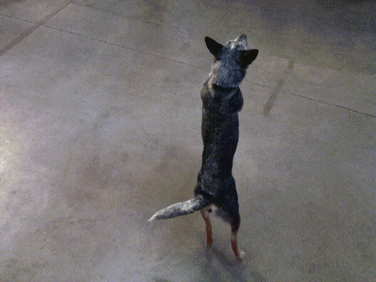

#### What is this?
The user experience side of a 360° bullet time style photo booth. This electron application provides the user with a countdown timer, then executes python scripts on an external computer, triggering 48 cameras then compiling a video. This application retrieves the video, and displays it to the user.

npm install

npm run electron
